צילומי המסך של צד הלקוח:
הוספת חבר חדש כולל כל פרטיו:
זאת הפונקציה
exports.addMember = async (req, res) => {
  try {
    const member = new Member(req.body);
    await member.save();
    res.status(201).json(member);
  } catch (err) {
    res.status(400).json({ error: err.message });
  }
};

בפוסטמן
בurl  אנחנו רושמים: http://localhost:5000/members
ובBODY:

זה צילום של השמירה שהצליחה במונוגו:

 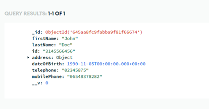

 
שליפתת כל החברים הקיימים במאגר:
זאת הפונקציה 
exports.getAllMembers = async (req, res) => {
  try {
    const members = await Member.find();
    res.json(members);
  } catch (err) {
    res.status(500).json({ error: err.message });
  }
};

בurl-  http://localhost:5000/members
ונקבל:

 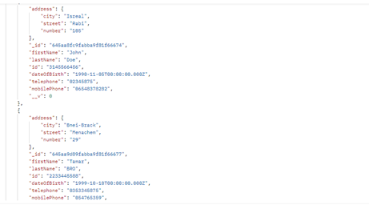
ובמסד נתונים נראה שיש לנו את אותם חברים:
 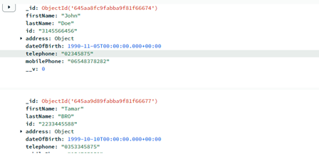
עכשיו נרצה לשלוף חבר לפי תעודת זהות
זה הפונקציה :
exports.getMemberById = async (req, res) => {
  try {
    const member = await Member.findOne({ id: req.params.id });
    if (!member) {
      return res.status(404).json({ error: 'Member not found' });
    }
    res.json(member);
  } catch (err) {
    res.status(500).json({ error: err.message });
  }
};

בפוסטמן: http://localhost:5000/members/3145566456
וקיבלנו:
 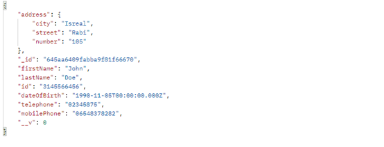
עכשיו אני רוצה ליצור פרטים בנושא הקורנה
זאת הפונקציה 

exports.addCoronaDetails = async (req, res) => {
  try {
    const member = await Member.findOne({ id: req.params.id });
    if (!member) {
      return res.status(404).json({ error: 'Member not found' });
    }

    let corona = await Corona.findOne({ memberId: member.id });
    if (!corona) {
      corona = new Corona({ memberId: member.id });
    }

    const { vaccines, positiveResult, recoveryDate } = req.body;

    if (positiveResult && positiveResult.date && isNaN(Date.parse(positiveResult.date))) {
      return res.status(400).json({ error: 'Invalid positive result date' });
    }

    if (recoveryDate && isNaN(Date.parse(recoveryDate))) {
      return res.status(400).json({ error: 'Invalid recovery date' });
    }

    if (positiveResult && corona.positiveResult && corona.positiveResult.date) {
      return res.status(400).json({ error: 'Cannot add positive result again' });
    }

    if (recoveryDate && corona.positiveResult && corona.positiveResult.recoveryDate) {
      return res.status(400).json({ error: 'Cannot add recovery date again' });
    }

    if (vaccines && Array.isArray(vaccines)) {
      const invalidVaccines = vaccines.filter(vaccine => {
        return !vaccine.date || !vaccine.manufacturer || !['Pfizer', 'Moderna', 'AstraZeneca', 'Bharat Biotech'].includes(vaccine.manufacturer);
      });
      if (invalidVaccines.length > 0) {
        return res.status(400).json({ error: 'Invalid vaccines data' });
      }
      if (corona.vaccines.length + vaccines.length > 4) {
        return res.status(400).json({ error: 'Cannot add more than 4 vaccine dates' });
      }
      corona.vaccines.push(...vaccines);
    }

    if (positiveResult) {
      if (corona.positiveResult) {
        corona.positiveResult.date = positiveResult.date;
      } else {
        corona.positiveResult = { date:  positiveResult.date };
      }
    }

    if (recoveryDate)  {
      if (corona.positiveResult && corona.positiveResult. recoveryDate) {
        corona.positiveResult.recoveryDate = recoveryDate;
      } else {
        if (!corona.positiveResult) {
          corona.positiveResult = {};
        }
        corona.positiveResult.recoveryDate = recoveryDate;
      }
    }

     await corona.save();

    res.json(corona);
  } catch (err) {
    res.status(500).json({ error: err.message });
  }
};

  
זה מה שרשמתי בפוסטמן:
בurl -http://localhost:5000/members/318522234/corona 
בbody-
בפוסטמן  בjson 
 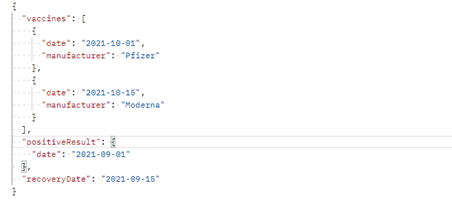
וקיבלנו 
 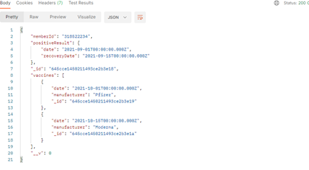
עכשיו נראה בdb שזה באמת נוצר:

 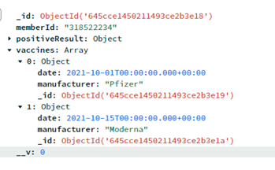

 עכשיו נעבור קצת על הבדיקות 
הוספנו לחבר בעל התעודת זהות 3145566456 
הid  שלו מהמנגו 
 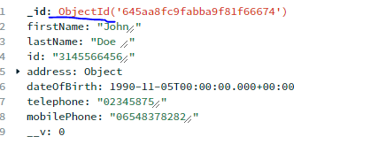
נבדוק אם אפשר להוסיף מעל 4
יש לאותו חבר 4 חיסונים: אני רואים שזה אותו חבר עי הid 
  

וכאן אנו רואים  שבאמת יש לו 4 חיסונים במסד נתונים
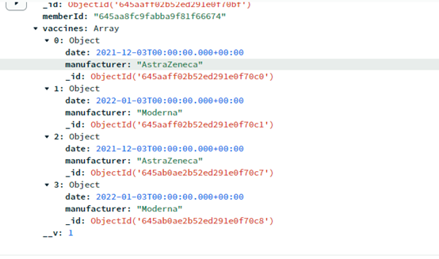
ע 
עכשיו ננסה להוסיף לו אחד חיסון:
 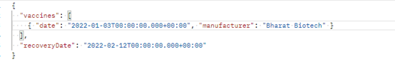
וקיבלנו:
 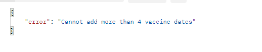
בדיקה שנניח אפשר לקבל רק פעם אחת תוצאה חיובית:
בפוסטמן:
 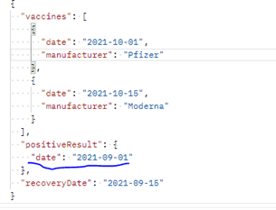
 וקבילנו הערה:
 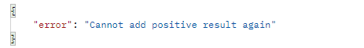

